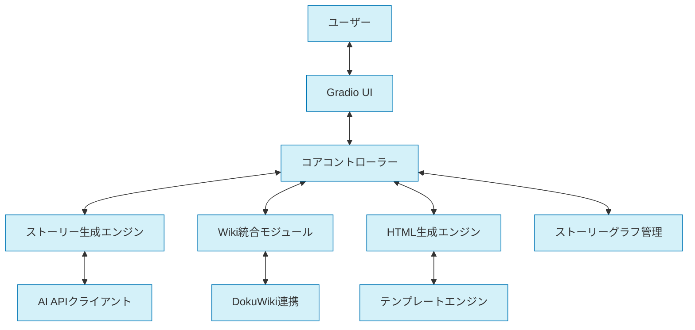

# FableMaze


対話型ストーリー生成システムを構築するためのフレームワークです。AIパワードのストーリー生成エンジン、Wiki統合、HTML生成エンジンを組み合わせて、分岐型の物語創作をサポートします。

## 主要機能

- 🔄 **インタラクティブストーリー**: 読者の選択に基づいて分岐するストーリー生成
- 🧠 **AIストーリーエンジン**: 大規模言語モデルを活用した物語創作
- 📚 **Wiki統合**: 世界観と設定の一貫性を維持するWikiシステム
- 🖥️ **HTML生成**: 美しいストーリーページの自動生成
- 📊 **ストーリーグラフ**: 分岐構造を視覚化・管理するシステム
- 🎨 **テンプレートシステム**: カスタマイズ可能なストーリーテンプレート

## システム概要



## クイックスタート

### インストール手順

```bash
# リポジトリをクローン
git clone https://github.com/yourusername/fablemaze.git
cd fablemaze

# poetryをインストール（まだの場合）
curl -sSL https://install.python-poetry.org | python3 -

# 仮想環境を作成して依存関係をインストール
poetry install

# 開発用依存関係もインストールする場合
poetry install --with dev

# 仮想環境を有効化
poetry shell

# アプリケーションを実行
poetry run fablemaze
```

その後、ブラウザで `http://localhost:7860` にアクセスしてください。

### コマンドラインオプション

アプリケーションは以下のコマンドラインオプションをサポートしています：

```bash
# モデルを指定して起動
poetry run fablemaze --model llama3

# テンプレートを指定して起動
poetry run fablemaze --template fantasy

# デバッグレベルを指定して起動
poetry run fablemaze --debug debug

# UIポートを指定して起動
poetry run fablemaze --port 8080

# 共有リンクを生成して起動
poetry run fablemaze --share

# すべてのオプションを組み合わせることも可能
poetry run fablemaze --model llama3 --template fantasy --debug debug --port 8080 --share
```

## その他のドキュメント

詳細については、以下のドキュメントを参照してください：

- [アーキテクチャ概要](docs/ARCHITECTURE.md)
- [開発環境のセットアップ](docs/DEVELOPMENT_SETUP.md)
- [コントリビューションガイド](docs/CONTRIBUTING.md)
- [API ドキュメント](docs/API_DOCUMENTATION.md)
- [製品要件定義](docs/PRD.md)
- [アプリケーションフロー](docs/APP_FLOW.md)
- [データベース設計](docs/DATABASE_SCHEMA.md)

## ライセンス

このプロジェクトは [MIT ライセンス](LICENSE) の下で公開されています。