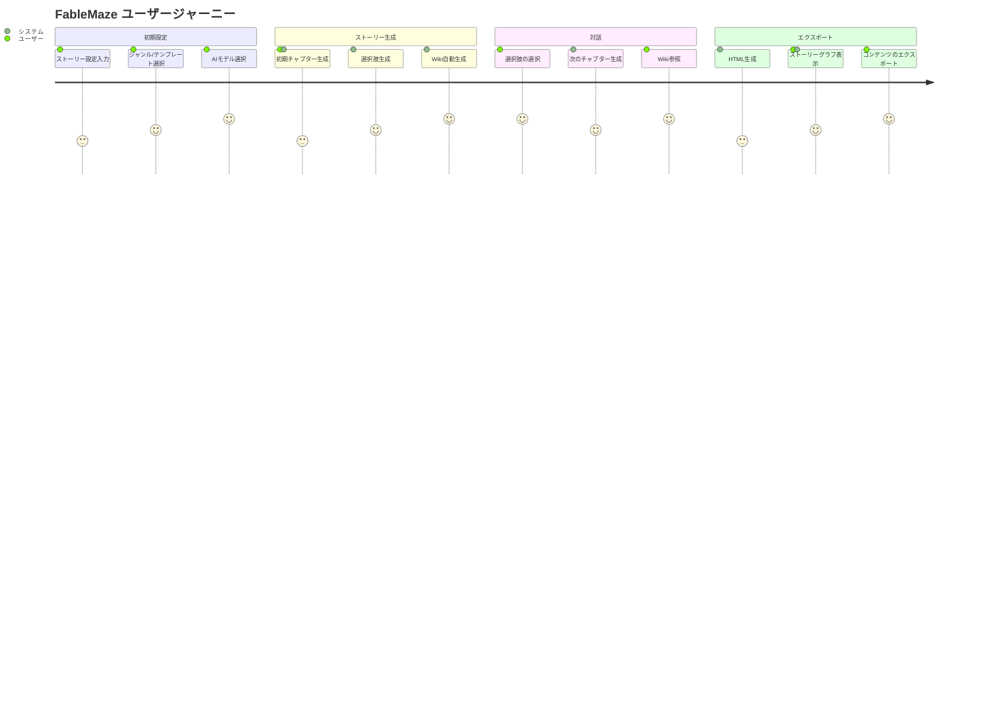
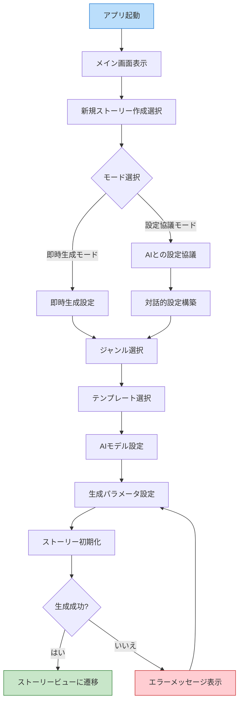
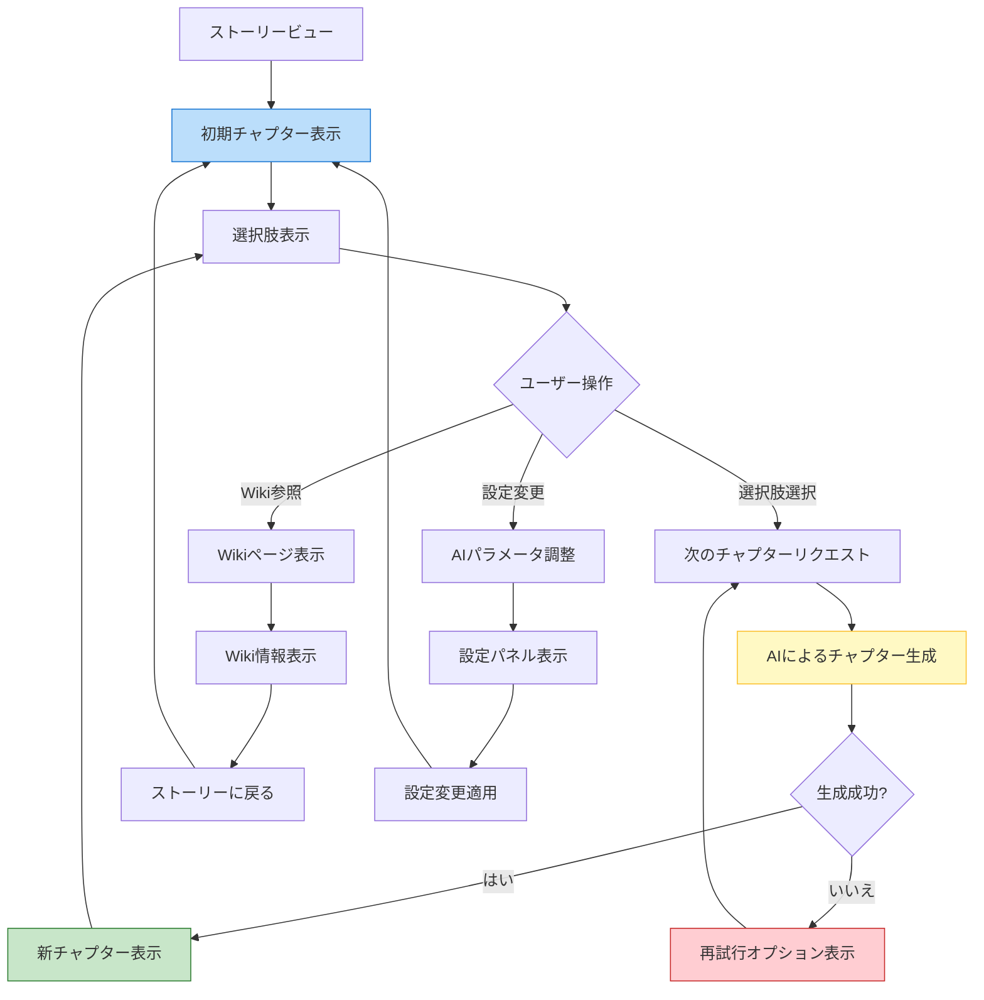
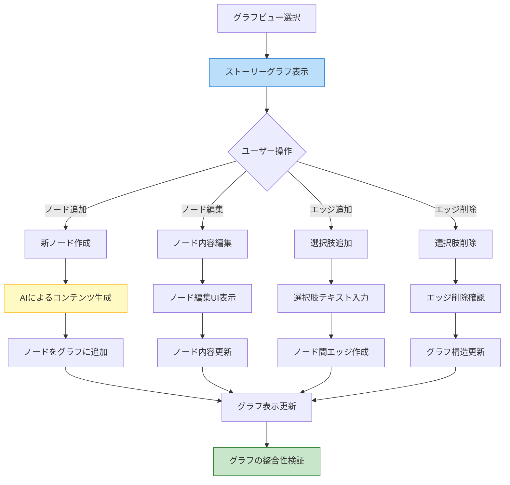
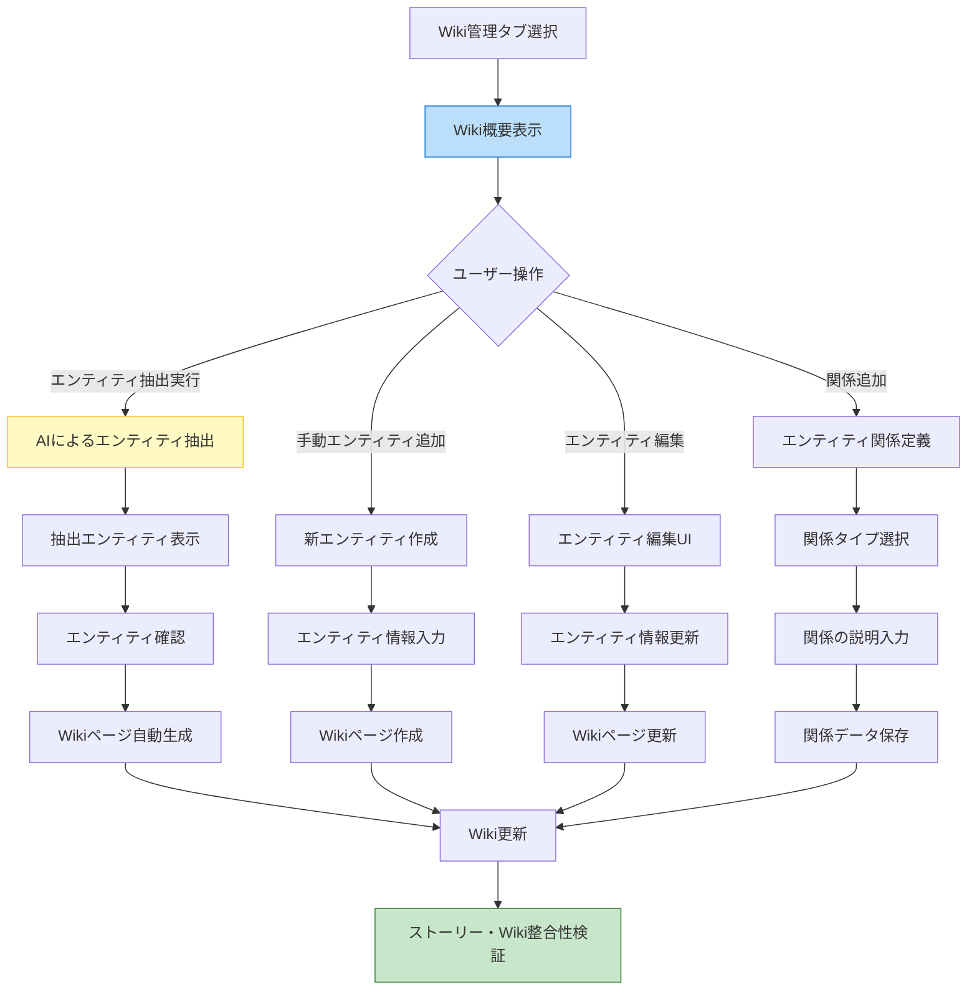
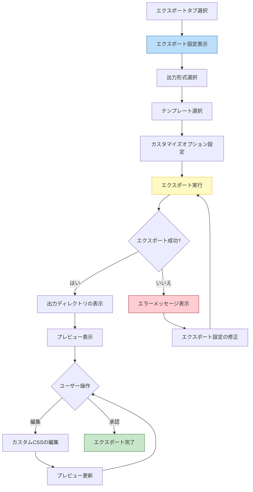
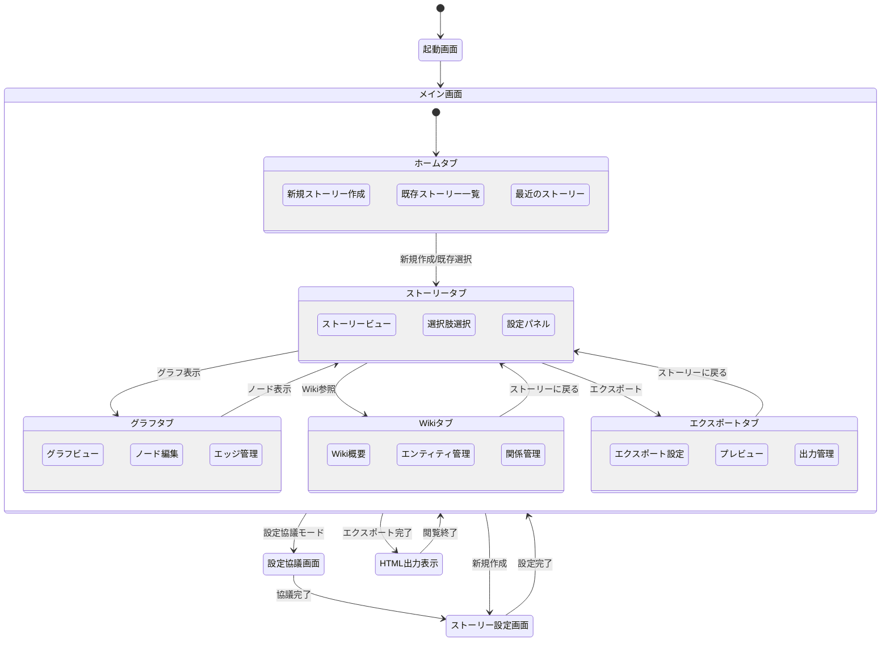
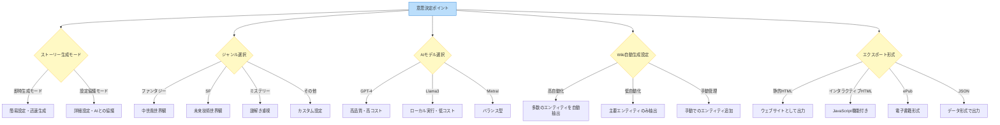
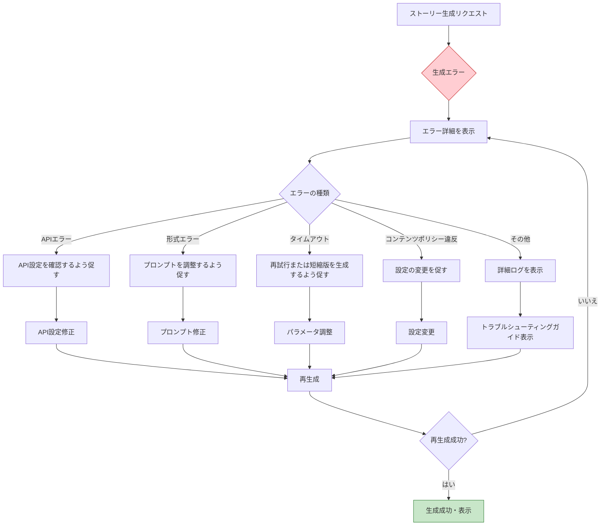

# アプリケーションフロー

このドキュメントでは、FableMaze の主要なユーザーフローと画面遷移について説明します。

## 全体的なユーザージャーニー

## 主要なユーザーシナリオ

### 1. ストーリー設定と初期化

ユーザーが新しいストーリーを設定し、初期化するフロー：

### 2. ストーリー生成と対話

ユーザーがストーリーと対話するフロー：

### 3. ストーリーグラフの管理

ストーリーの分岐構造を管理するフロー：

### 4. Wiki統合と管理

Wikiの管理と統合を行うフロー：

### 5. HTMLエクスポートとプレビュー

ストーリーをHTMLにエクスポートするフロー：

## 画面遷移図

アプリケーションの主要な画面とその遷移：

## 主要画面の目的

### 1. ホーム画面

- **目的**: アプリケーションのエントリーポイント
- **機能**:
  - 新規ストーリー作成の開始
  - 既存ストーリーの一覧表示と選択
  - 最近のストーリーへの素早いアクセス
  - アプリケーション設定へのアクセス

### 2. ストーリー設定画面

- **目的**: 新規ストーリーの設定
- **機能**:
  - ジャンル選択
  - テンプレート選択
  - AIモデル設定
  - 生成パラメータ設定

### 3. 設定協議画面

- **目的**: AIとの対話による設定構築
- **機能**:
  - AIとの対話インターフェース
  - 設定サマリーの表示
  - 設定の調整と確定
  - キャラクターや世界観の協創

### 4. ストーリービュー

- **目的**: ストーリー閲覧と対話
- **機能**:
  - 現在のチャプター表示
  - 選択肢の提示と選択
  - Wiki参照リンク
  - 設定調整オプション

### 5. グラフビュー

- **目的**: ストーリー構造の可視化と編集
- **機能**:
  - 全体のグラフ表示
  - ノードの追加・編集・削除
  - エッジ（選択肢）の管理
  - 到達可能性分析

### 6. Wiki管理画面

- **目的**: 世界観の一貫性管理
- **機能**:
  - エンティティの一覧表示
  - 新規エンティティの作成
  - エンティティ間の関係定義
  - 自動抽出機能

### 7. エクスポート画面

- **目的**: ストーリーのエクスポートと公開
- **機能**:
  - 出力形式の選択
  - テンプレートのカスタマイズ
  - プレビュー表示
  - 出力先の設定

## 重要な意思決定ポイント

アプリケーション内の主要な意思決定ポイントとその選択肢：

## エラーケースと代替フロー

### 1. ストーリー生成エラー

AIからのレスポンスに問題がある場合の代替フロー：

