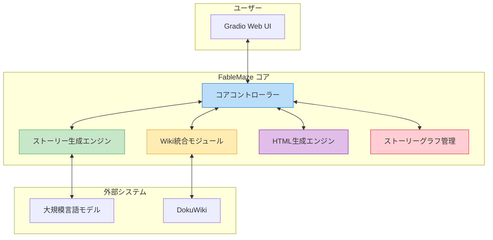
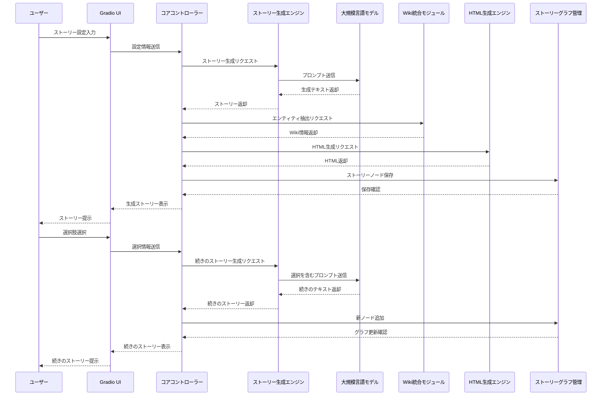
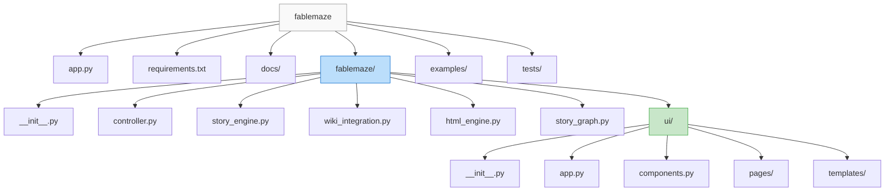
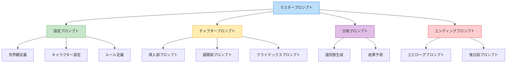
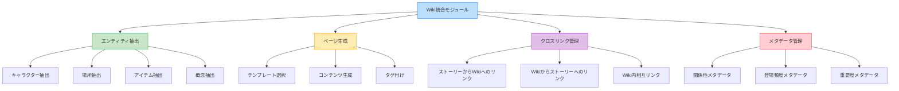
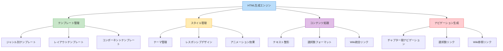
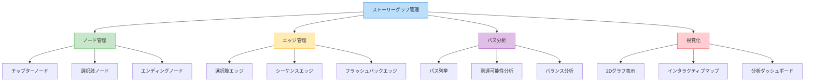

# アーキテクチャ概要

このドキュメントは FableMaze の全体的なアーキテクチャについて説明します。

## システム概要

FableMaze は、AIを活用したインタラクティブなストーリー生成システムです。フロントエンド（Gradio UI）、ストーリー生成エンジン、Wiki統合、HTML生成エンジンという4つの主要コンポーネントで構成されています。

## 主要コンポーネント

### 1. コアコントローラー

システム全体の制御と調整を担当するコンポーネントです。

- **Session Manager**: ユーザーセッションの管理
- **Workflow Coordinator**: ストーリー生成ワークフローの調整
- **Component Integrator**: 各コンポーネント間の連携管理
- **Configuration Manager**: システム設定の管理

### 2. ストーリー生成エンジン

AIを活用したストーリー創作を担当するコンポーネントです。

- **AI Client**: 大規模言語モデルとの通信
- **Prompt Manager**: プロンプト設計と管理
- **Context Handler**: 物語コンテキストの管理
- **Choice Generator**: 分岐選択肢の生成

### 3. Wiki統合モジュール

世界観の一貫性を維持するためのWiki連携を担当するコンポーネントです。

- **Entity Extractor**: 物語からエンティティを抽出
- **Wiki Formatter**: DokuWiki形式へのフォーマット
- **Sync Manager**: Wiki内容と物語の同期
- **Consistency Checker**: 設定の一貫性チェック

### 4. HTML生成エンジン

物語をHTMLページとして出力するコンポーネントです。

- **Template Engine**: Jinja2テンプレート処理
- **CSS Manager**: スタイルシートの管理
- **Page Assembler**: ページの組み立て
- **Navigation Builder**: ナビゲーション構造の構築

### 5. ストーリーグラフ管理

物語の分岐構造を管理するコンポーネントです。

- **Graph Database**: 物語ノードとエッジの保存
- **Path Analyzer**: ストーリーパスの分析
- **Visualization Tool**: グラフの視覚化
- **Consistency Checker**: グラフの整合性検証

## データフロー

ユーザーがFableMazeを通じてストーリーを生成・閲覧する際のデータフローを示します。

## フォルダ構成

## 技術選定

| コンポーネント | 技術 | 選定理由 |
|----------------|------|----------|
| バックエンド言語 | Python 3.10+ | 機械学習ライブラリとの広範な互換性、asyncio での非同期処理サポート |
| AIエンジン | OpenAI API / Ollama | 高品質なテキスト生成、ローカル実行オプション |
| ウェブ UI | Gradio | 迅速な UI 開発、ML プロジェクトとの相性の良さ、コンポーネント豊富 |
| テンプレートエンジン | Jinja2 | 柔軟なHTMLテンプレート処理、Pythonとの統合の容易さ |
| Wiki システム | DokuWiki | シンプルなファイルベースの構造、APIの利用しやすさ |
| グラフデータベース | NetworkX | Pythonネイティブのグラフ処理、データ分析の容易さ |
| 依存関係管理 | Poetry | パッケージ管理の一貫性、仮想環境管理の容易さ |
| テスト | pytest | 豊富なテスト機能、asyncio 対応のテストサポート |

## アーキテクチャの原則

1. **モジュール性**: 機能を明確に分離し、独立して開発・テスト可能なコンポーネント設計
2. **拡張性**: 新しいストーリーテンプレートやモデルの追加が容易な柔軟な基盤
3. **一貫性**: 物語世界の設定と内容の一貫性を保証するメカニズム
4. **使いやすさ**: 作家と読者の両方にとって直感的なインターフェース
5. **堅牢性**: エラー処理と回復メカニズムの組み込み
6. **パフォーマンス**: 大規模な物語構造でも効率的に機能する設計
7. **創造性**: AIの創造性を最大限に引き出し、人間の創造性を拡張する

このアーキテクチャにより、FableMazeは複雑なインタラクティブストーリーの作成と体験を可能にし、作家と読者の双方に新たな物語体験の可能性を提供します。

## プロンプト設計システム

階層的なプロンプト設計構造により、一貫性のある魅力的なストーリーを生成します。

各プロンプトレベルは特定の役割を持ち、全体として一貫性のある魅力的なストーリーを構築します。

## Wiki統合システムの詳細

DokuWikiをベースにした統合Wikiシステムにより、ストーリー間の一貫性を管理します。

## HTML生成システムの詳細

Jinja2テンプレートエンジンを用いたHTML生成システムの構造を示します。

## ストーリーグラフデータ構造

物語の分岐構造を有向グラフとして管理するシステムの詳細です。

このアーキテクチャにより、FableMazeはAIの創造性を活用しながら一貫性のある豊かなストーリー体験を提供することが可能になります。