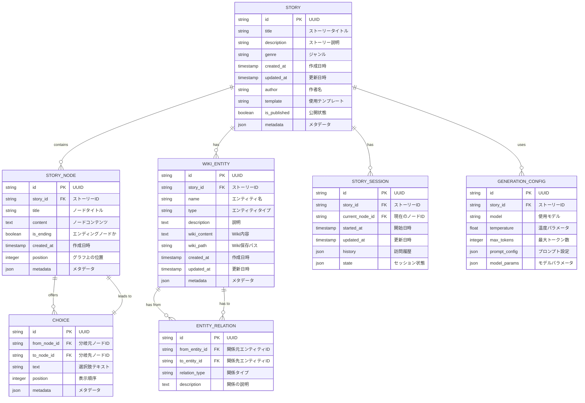
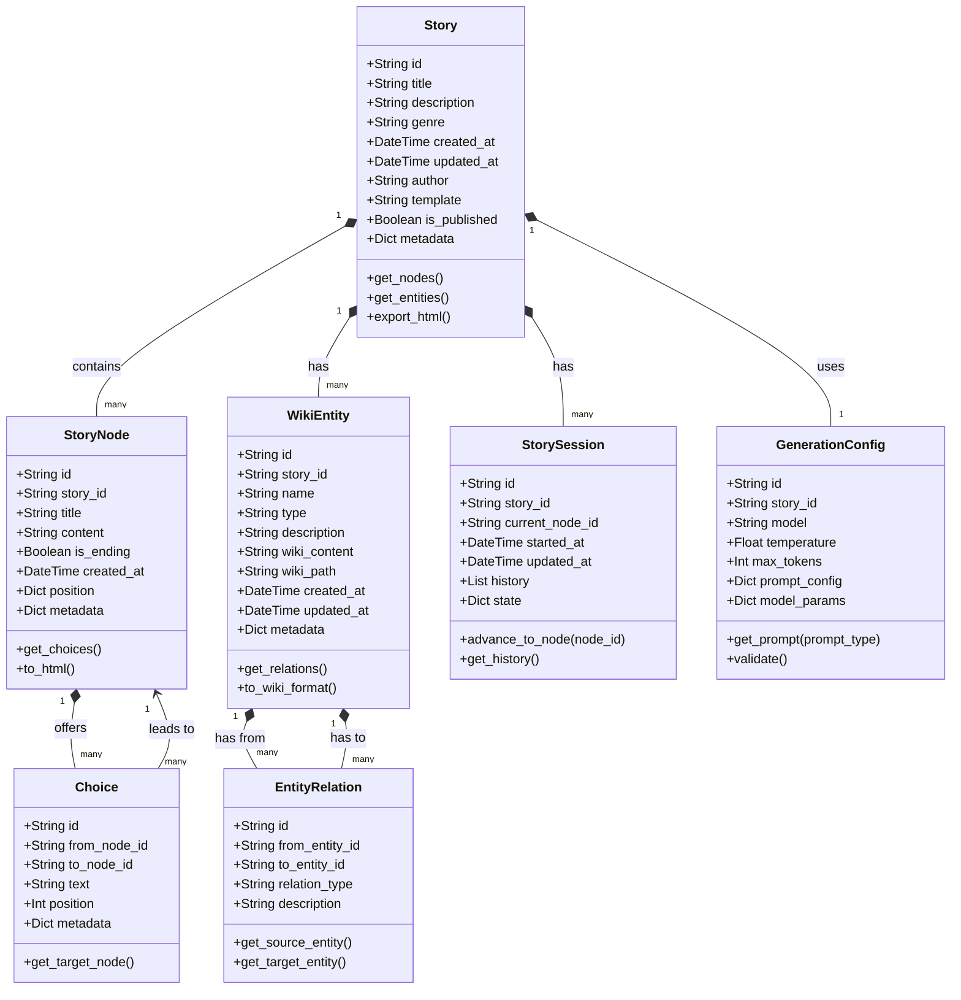

# データベース設計

このドキュメントでは、FableMazeのデータモデルと永続化層の設計について説明します。FableMazeではローカルのSQLiteデータベースとファイルベースのストレージを組み合わせて使用しています。

## ER図

以下は、FableMazeのデータベースのER図です：



## テーブル詳細

### STORY テーブル

ストーリーの基本情報を格納します。

| カラム | 型 | 説明 | 備考 |
|--------|------|-----------|------|
| id | TEXT | 主キー | UUID v4 |
| title | TEXT | ストーリータイトル | NOT NULL |
| description | TEXT | ストーリー説明 | |
| genre | TEXT | ジャンル | fantasy, scifi, mystery など |
| created_at | TIMESTAMP | 作成日時 | デフォルトは現在時刻 |
| updated_at | TIMESTAMP | 更新日時 | |
| author | TEXT | 作者名 | |
| template | TEXT | 使用テンプレート | テンプレートディレクトリ名 |
| is_published | BOOLEAN | 公開状態 | デフォルトはfalse |
| metadata | JSON | 追加メタデータ | タグなどの任意情報 |

```sql
CREATE TABLE story (
    id TEXT PRIMARY KEY,
    title TEXT NOT NULL,
    description TEXT,
    genre TEXT,
    created_at TIMESTAMP DEFAULT CURRENT_TIMESTAMP,
    updated_at TIMESTAMP,
    author TEXT,
    template TEXT,
    is_published BOOLEAN DEFAULT 0,
    metadata JSON
);
```

### STORY_NODE テーブル

物語の各ノード（チャプター）を格納します。

| カラム | 型 | 説明 | 備考 |
|--------|------|-----------|------|
| id | TEXT | 主キー | UUID v4 |
| story_id | TEXT | ストーリーID | 外部キー |
| title | TEXT | ノードタイトル | |
| content | TEXT | ノードコンテンツ | ストーリーテキスト |
| is_ending | BOOLEAN | エンディングノードか | デフォルトはfalse |
| created_at | TIMESTAMP | 作成日時 | デフォルトは現在時刻 |
| position | INTEGER | グラフ上の位置 | JSON形式 `{"x": 0, "y": 0}` |
| metadata | JSON | メタデータ | |

```sql
CREATE TABLE story_node (
    id TEXT PRIMARY KEY,
    story_id TEXT NOT NULL,
    title TEXT,
    content TEXT NOT NULL,
    is_ending BOOLEAN DEFAULT 0,
    created_at TIMESTAMP DEFAULT CURRENT_TIMESTAMP,
    position INTEGER,
    metadata JSON,
    FOREIGN KEY (story_id) REFERENCES story(id) ON DELETE CASCADE
);
```

### CHOICE テーブル

ノード間の選択肢（エッジ）を格納します。

| カラム | 型 | 説明 | 備考 |
|--------|------|-----------|------|
| id | TEXT | 主キー | UUID v4 |
| from_node_id | TEXT | 分岐元ノードID | 外部キー |
| to_node_id | TEXT | 分岐先ノードID | 外部キー |
| text | TEXT | 選択肢テキスト | NOT NULL |
| position | INTEGER | 表示順序 | |
| metadata | JSON | メタデータ | |

```sql
CREATE TABLE choice (
    id TEXT PRIMARY KEY,
    from_node_id TEXT NOT NULL,
    to_node_id TEXT NOT NULL,
    text TEXT NOT NULL,
    position INTEGER,
    metadata JSON,
    FOREIGN KEY (from_node_id) REFERENCES story_node(id) ON DELETE CASCADE,
    FOREIGN KEY (to_node_id) REFERENCES story_node(id) ON DELETE CASCADE
);
```

### WIKI_ENTITY テーブル

ストーリー内のエンティティ（キャラクター、場所など）を格納します。

| カラム | 型 | 説明 | 備考 |
|--------|------|-----------|------|
| id | TEXT | 主キー | UUID v4 |
| story_id | TEXT | ストーリーID | 外部キー |
| name | TEXT | エンティティ名 | NOT NULL |
| type | TEXT | エンティティタイプ | character, location, item など |
| description | TEXT | 説明 | |
| wiki_content | TEXT | Wiki内容 | DokuWiki形式 |
| wiki_path | TEXT | Wiki保存パス | |
| created_at | TIMESTAMP | 作成日時 | デフォルトは現在時刻 |
| updated_at | TIMESTAMP | 更新日時 | |
| metadata | JSON | メタデータ | |

```sql
CREATE TABLE wiki_entity (
    id TEXT PRIMARY KEY,
    story_id TEXT NOT NULL,
    name TEXT NOT NULL,
    type TEXT,
    description TEXT,
    wiki_content TEXT,
    wiki_path TEXT,
    created_at TIMESTAMP DEFAULT CURRENT_TIMESTAMP,
    updated_at TIMESTAMP,
    metadata JSON,
    FOREIGN KEY (story_id) REFERENCES story(id) ON DELETE CASCADE
);
```

### ENTITY_RELATION テーブル

エンティティ間の関係を格納します。

| カラム | 型 | 説明 | 備考 |
|--------|------|-----------|------|
| id | TEXT | 主キー | UUID v4 |
| from_entity_id | TEXT | 関係元エンティティID | 外部キー |
| to_entity_id | TEXT | 関係先エンティティID | 外部キー |
| relation_type | TEXT | 関係タイプ | friend_of, located_in など |
| description | TEXT | 関係の説明 | |

```sql
CREATE TABLE entity_relation (
    id TEXT PRIMARY KEY,
    from_entity_id TEXT NOT NULL,
    to_entity_id TEXT NOT NULL,
    relation_type TEXT NOT NULL,
    description TEXT,
    FOREIGN KEY (from_entity_id) REFERENCES wiki_entity(id) ON DELETE CASCADE,
    FOREIGN KEY (to_entity_id) REFERENCES wiki_entity(id) ON DELETE CASCADE
);
```

### STORY_SESSION テーブル

ユーザーの読書セッションを格納します。

| カラム | 型 | 説明 | 備考 |
|--------|------|-----------|------|
| id | TEXT | 主キー | UUID v4 |
| story_id | TEXT | ストーリーID | 外部キー |
| current_node_id | TEXT | 現在のノードID | 外部キー |
| started_at | TIMESTAMP | 開始日時 | デフォルトは現在時刻 |
| updated_at | TIMESTAMP | 更新日時 | |
| history | JSON | 訪問履歴 | ノードIDのリスト |
| state | JSON | セッション状態 | |

### GENERATION_CONFIG テーブル

ストーリー生成のための設定を格納します。

| カラム | 型 | 説明 | 備考 |
|--------|------|-----------|------|
| id | TEXT | 主キー | UUID v4 |
| story_id | TEXT | ストーリーID | 外部キー |
| model | TEXT | 使用モデル | gpt-4, llama3 など |
| temperature | REAL | 温度パラメータ | デフォルトは0.7 |
| max_tokens | INTEGER | 最大トークン数 | デフォルトは2000 |
| prompt_config | JSON | プロンプト設定 | |
| model_params | JSON | モデルパラメータ | |

```sql
CREATE TABLE generation_config (
    id TEXT PRIMARY KEY,
    story_id TEXT NOT NULL,
    model TEXT NOT NULL,
    temperature REAL DEFAULT 0.7,
    max_tokens INTEGER DEFAULT 2000,
    prompt_config JSON,
    model_params JSON,
    FOREIGN KEY (story_id) REFERENCES story(id) ON DELETE CASCADE
);
```

## ファイルストレージ構造

データベース以外のファイルベースのストレージ構造は以下の通りです：

### 出力ディレクトリ構造

```
output/
├── stories/
│   ├── [story_id]/
│   │   ├── index.html                # ストーリートップページ
│   │   ├── [node_id].html            # 各ノードのHTMLページ
│   │   ├── assets/                   # アセットディレクトリ
│   │   │   ├── css/                  # CSSスタイルシート
│   │   │   │   └── theme.css
│   │   │   ├── js/                   # JavaScriptファイル
│   │   │   │   └── navigation.js
│   │   │   └── images/               # 画像ファイル（将来的に自動生成）
│   │   └── metadata.json             # ストーリーメタデータ
│   └── ...
└── wiki/
    ├── [story_id]/
    │   ├── index.html                # Wiki トップページ
    │   ├── pages/                    # Wiki ページ
    │   │   ├── [entity_id].html      # 各エンティティのページ
    │   │   └── ...
    │   ├── data/                     # DokuWiki データ
    │   │   ├── pages/                # ページデータ
    │   │   ├── meta/                 # メタデータ
    │   │   └── ...
    │   └── metadata.json             # Wiki メタデータ
    └── ...
```

## データモデル関連図

モデル間の関連性を詳細に示します：



## インデックス

パフォーマンスを最適化するために以下のインデックスを設定します：

```sql
-- StoryNode テーブルのインデックス
CREATE INDEX idx_story_node_story_id ON story_node(story_id);
CREATE INDEX idx_story_node_is_ending ON story_node(is_ending);

-- Choice テーブルのインデックス
CREATE INDEX idx_choice_from_node_id ON choice(from_node_id);
CREATE INDEX idx_choice_to_node_id ON choice(to_node_id);

-- WikiEntity テーブルのインデックス
CREATE INDEX idx_wiki_entity_story_id ON wiki_entity(story_id);
CREATE INDEX idx_wiki_entity_type ON wiki_entity(type);
CREATE INDEX idx_wiki_entity_name ON wiki_entity(name);

-- EntityRelation テーブルのインデックス
CREATE INDEX idx_entity_relation_from_entity_id ON entity_relation(from_entity_id);
CREATE INDEX idx_entity_relation_to_entity_id ON entity_relation(to_entity_id);
CREATE INDEX idx_entity_relation_relation_type ON entity_relation(relation_type);

-- StorySession テーブルのインデックス
CREATE INDEX idx_story_session_story_id ON story_session(story_id);
CREATE INDEX idx_story_session_current_node_id ON story_session(current_node_id);

-- GenerationConfig テーブルのインデックス
CREATE INDEX idx_generation_config_story_id ON generation_config(story_id);
```

## データマイグレーション

データベーススキーマの更新は以下のように管理します：

1. マイグレーションスクリプトを `migrations/` ディレクトリに格納
2. 各マイグレーションはタイムスタンプ付きの名前を持つ（例: `20250315_001_initial.sql`）
3. マイグレーション適用履歴を追跡するための `schema_version` テーブルを使用

```sql
-- スキーマバージョン管理テーブル
CREATE TABLE schema_version (
    id INTEGER PRIMARY KEY AUTOINCREMENT,
    version TEXT NOT NULL,
    applied_at TIMESTAMP DEFAULT CURRENT_TIMESTAMP,
    description TEXT
);
```

このデータベース設計により、FableMazeは複雑なストーリー構造と関連情報を効率的に管理し、拡張性の高いシステムを実現します。

```sql
CREATE TABLE story_session (
    id TEXT PRIMARY KEY,
    story_id TEXT NOT NULL,
    current_node_id TEXT,
    started_at TIMESTAMP DEFAULT CURRENT_TIMESTAMP,
    updated_at TIMESTAMP,
    history JSON,
    state JSON,
    FOREIGN KEY (story_id) REFERENCES story(id) ON DELETE CASCADE,
    FOREIGN KEY (current_node_id) REFERENCES story_node(id) ON DELETE SET NULL
);