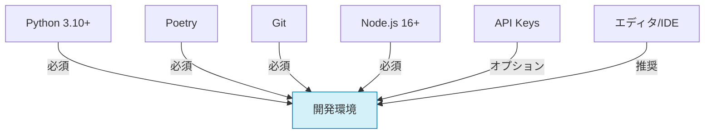
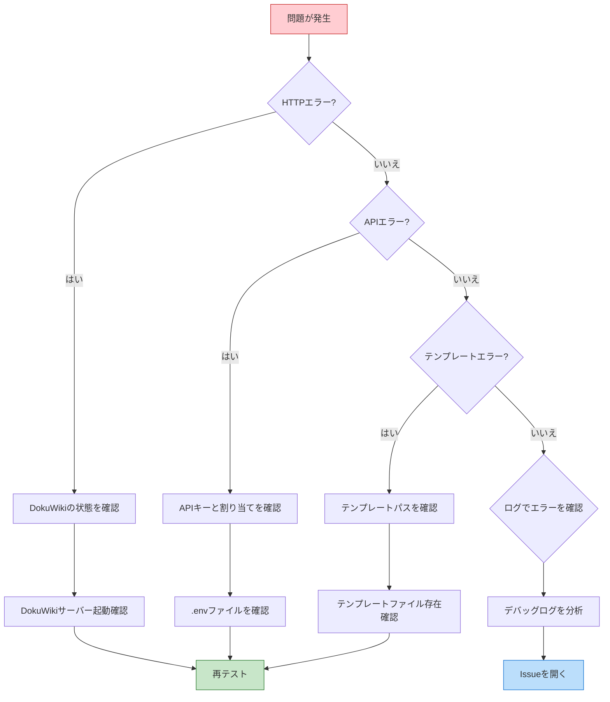

# 開発環境のセットアップ

このドキュメントでは、FableMaze の開発環境をセットアップする手順を説明します。

## 前提条件

開発を始める前に、以下のソフトウェアがインストールされていることを確認してください：

- Python 3.10以上
- Poetry（Python依存関係マネージャ）
- Git
- Node.js 16以上（HTMLプレビュー機能のため）
- 必要に応じて：
  - OpenAI API キー（OpenAIモデルを使用する場合）
  - その他のAIモデルプロバイダーのAPI キー



## 環境セットアップ手順

### 1. リポジトリのクローン

```bash
git clone https://github.com/yourusername/fablemaze.git
cd fablemaze
```

### 2. 開発用仮想環境の作成

```bash
# poetryをインストール（まだの場合）
curl -sSL https://install.python-poetry.org | python3 -

# 開発用依存関係を含むすべての依存関係をインストール
poetry install --with dev

# フロントエンド依存関係のインストール
npm install

# 仮想環境を有効化
poetry shell
```

### 3. 環境変数の設定

`.env`ファイルを作成し、必要な環境変数を設定します：

```bash
# .envファイルを作成
touch .env

# 以下の内容を追加
OPENAI_API_KEY=your_key_here  # OpenAIモデルを使用する場合
DOKUWIKI_URL=http://localhost/dokuwiki  # ローカルDokuWikiのURL
DOKUWIKI_USERNAME=admin  # DokuWikiの管理者ユーザー名
DOKUWIKI_PASSWORD=password  # DokuWikiの管理者パスワード
DEBUG=true  # デバッグモードを有効化
```

### 4. DokuWikiのセットアップ

Wiki統合機能をテストするには、DokuWikiのローカルインスタンスが必要です：

#### 方法1: Docker

```bash
# DokuWikiコンテナを実行
docker run -d --name dokuwiki -p 80:80 linuxserver/dokuwiki

# コンテナ起動後、http://localhost/dokuwiki にアクセスして初期設定を行います
```

#### 方法2: 手動インストール

1. [DokuWiki公式サイト](https://www.dokuwiki.org/dokuwiki)からパッケージをダウンロード
2. お使いのウェブサーバー（Apache, Nginx等）にDokuWikiを設置
3. インストールウィザードに従ってセットアップ

### 5. プレコミットフックの設定

コードの品質を保つために、プレコミットフックを設定します：

```bash
# プレコミットをインストール
poetry add --group dev pre-commit

# プレコミットフックを設定
pre-commit install
```

## 開発用フォルダ構成

プロジェクトのフォルダ構成は以下の通りです：

```
fablemaze/
├── __init__.py
├── controller.py       # メインコントローラー
├── story_engine/       # ストーリー生成機能
│   ├── __init__.py
│   ├── generator.py
│   ├── prompt_manager.py
│   └── context.py
├── wiki_integration/   # Wiki統合機能
│   ├── __init__.py
│   ├── connector.py
│   ├── entity_extractor.py
│   └── formatter.py
├── html_engine/        # HTML生成機能
│   ├── __init__.py
│   ├── template_manager.py
│   ├── renderer.py
│   └── assets.py
├── story_graph/        # ストーリーグラフ管理
│   ├── __init__.py
│   ├── graph.py
│   ├── node.py
│   └── analysis.py
├── ui/                 # Gradio UI
│   ├── __init__.py
│   ├── app.py
│   ├── components.py
│   └── pages/
└── utils/              # ユーティリティ
    ├── __init__.py
    ├── config.py
    └── logger.py
```

## テンプレートとプロンプトの構成

テンプレートとプロンプトは以下のディレクトリ構造で管理されます：

```
fablemaze/
├── templates/            # HTMLテンプレート
│   ├── base.html         # 基本テンプレート
│   ├── fantasy/          # ファンタジージャンル
│   │   ├── config.json   # 設定
│   │   ├── base.html     # ジャンル固有テンプレート
│   │   └── styles.css    # スタイルシート
│   ├── scifi/            # SFジャンル
│   └── mystery/          # ミステリージャンル
└── prompts/              # プロンプトテンプレート
    ├── base/             # 基本プロンプト
    │   ├── setting.txt   # 設定プロンプト
    │   ├── chapter.txt   # チャプタープロンプト
    │   ├── choice.txt    # 選択肢プロンプト
    │   └── ending.txt    # エンディングプロンプト
    ├── fantasy/          # ファンタジージャンル
    ├── scifi/            # SFジャンル
    └── mystery/          # ミステリージャンル
```

## 開発ワークフロー

### 1. 機能実装

1. 新しいブランチを作成：
   ```bash
   git checkout -b feature/new-feature-name
   ```

2. コードを実装し、テストを追加

3. フォーマットとリンターを実行：
   ```bash
   # コードフォーマット
   poetry run format
   
   # インポート順序の整理
   poetry run lint
   
   # 型チェック
   poetry run typecheck
   ```

4. テストを実行：
   ```bash
   # 全テスト実行
   poetry run test
   
   # カバレッジ付きでテスト実行
   poetry run pytest --cov=fablemaze
   ```

### 2. アプリケーションの実行

開発中にアプリケーションを実行するには：

```bash
# メインアプリケーションを実行
poetry run fablemaze

# または特定のオプションで実行
poetry run fablemaze --model gpt-4 --template fantasy --debug
```

## デバッグ

### VSCode でのデバッグ

VSCode を使用している場合は、次の `.vscode/launch.json` 設定を使用できます：

```json
{
    "version": "0.2.0",
    "configurations": [
        {
            "name": "Run FableMaze",
            "type": "python",
            "request": "launch",
            "program": "${workspaceFolder}/app.py",
            "console": "integratedTerminal",
            "justMyCode": false,
            "env": {
                "PYTHONPATH": "${workspaceFolder}",
                "DEBUG": "true"
            }
        },
        {
            "name": "Run Current File",
            "type": "python",
            "request": "launch",
            "program": "${file}",
            "console": "integratedTerminal",
            "justMyCode": false,
            "env": {
                "PYTHONPATH": "${workspaceFolder}",
                "DEBUG": "true"
            }
        }
    ]
}
```

### トラブルシューティング

よくある問題と解決策：



#### DokuWiki連携問題

**症状**: `Connection refused` または `DokuWiki server not responding` エラーが発生する

**解決策**:
1. DokuWikiサーバーが実行中か確認
2. URLが正しいか確認
3. 認証情報が正しいか確認

#### API制限の問題

**症状**: `Rate limit exceeded` または `API quota exceeded` エラーが発生する

**解決策**:
```bash
# テスト用にモックAPIモードを有効化
export USE_MOCK_API=true

# または開発中は低頻度/低コストのモデルを使用
poetry run fablemaze --model gpt-3.5-turbo
```

#### テンプレート関連の問題

**症状**: `Template not found` または `Jinja2 rendering error` が発生する

**解決策**:
1. テンプレートパスが正しいか確認
2. 構文エラーをチェック
3. デバッグモードでエラー詳細を確認：
   ```bash
   poetry run fablemaze --debug debug
   ```

## 参考リンク

- [Jinja2ドキュメント](https://jinja.palletsprojects.com/)
- [DokuWiki APIドキュメント](https://www.dokuwiki.org/devel:xmlrpc)
- [Gradioドキュメント](https://gradio.app/docs)
- [NetworkXドキュメント](https://networkx.org/documentation/stable/)

質問がある場合は、Issueトラッカーで質問するか、メインリポジトリのDiscussionsセクションを利用してください。