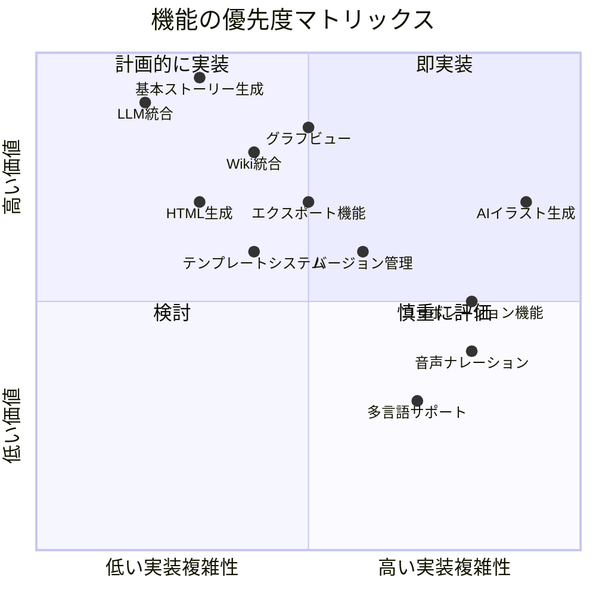
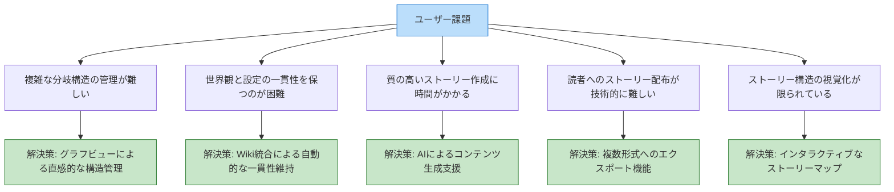
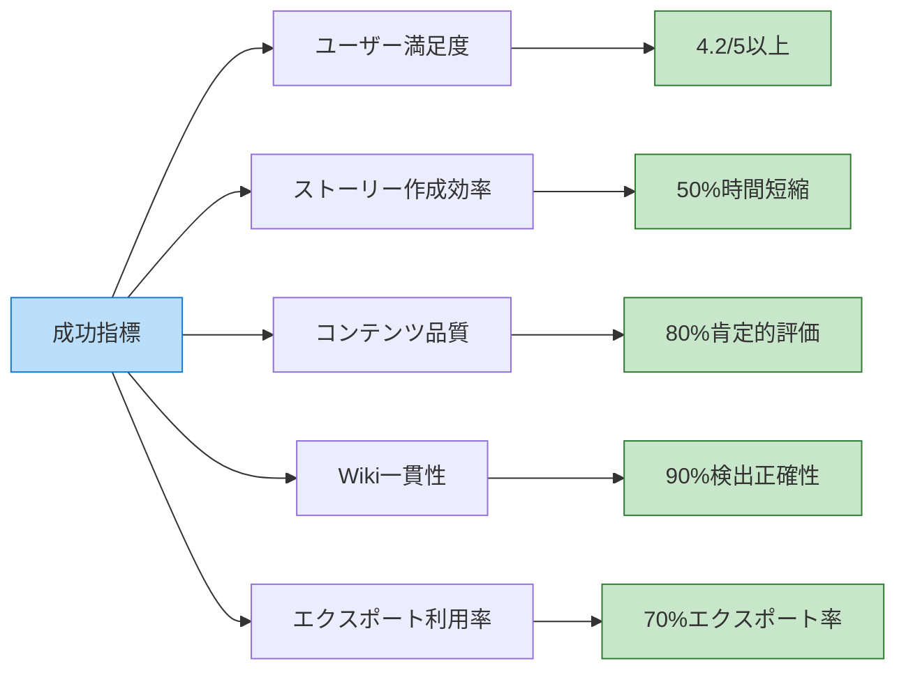
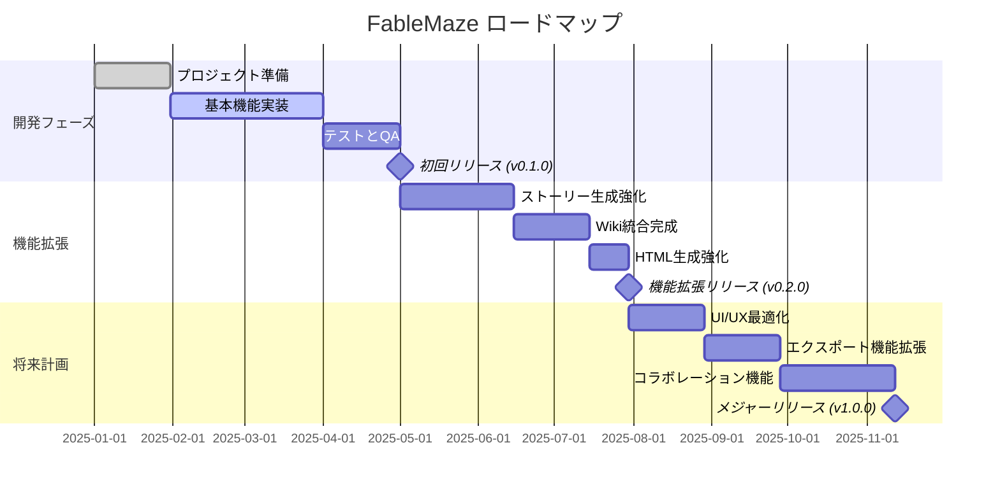

# 製品要件定義書 (PRD)

## 製品概要

**製品名**: FableMaze  
**バージョン**: 0.1.0  
**最終更新日**: 2025年3月29日

### 製品ビジョン

FableMazeは、AIパワードのストーリー生成エンジン、Wiki統合、HTML生成エンジンを組み合わせて、創造的で分岐型の物語創作をサポートするインタラクティブストーリー生成フレームワークです。作家や読者に対して、豊かな物語体験を提供し、創造性を拡張します。

### 主要目標

1. 直感的なUIを通じて、複雑で分岐するインタラクティブストーリーの作成を可能にする
2. 大規模言語モデル（LLM）を活用した質の高いストーリー生成を実現する
3. Wikiシステムとの統合により、世界観と設定の一貫性を維持する
4. 美しいHTMLページとして物語をエクスポートする機能を提供する
5. ストーリーの分岐構造を視覚化・管理するためのツールを開発する

## ターゲットユーザー

### ペルソナ

#### 1. クリエイティブライターマリア
- **ロール**: インタラクティブストーリー作家
- **経験**: 従来の小説執筆経験5年、インタラクティブフィクション経験1年
- **目標**: 複雑な分岐を持つストーリーを効率的に作成し、読者に提供したい
- **課題**: 分岐構造の管理が難しく、設定の一貫性を保つのに時間がかかる
- **期待**: 創作プロセスを簡素化し、設定の一貫性を自動的に維持してくれるツール

#### 2. ゲームデザイナートム
- **ロール**: ナラティブゲームデザイナー
- **経験**: ゲーム業界で5年、ストーリーテリング重視のゲーム開発
- **目標**: プロトタイピング段階でストーリーの分岐を迅速に構築し、テストしたい
- **課題**: ストーリー分岐の作成に時間がかかり、テストが大変
- **期待**: AIの助けを借りて迅速にストーリープロトタイプを作成し、視覚化できるツール

#### 3. 教育者エミリー
- **ロール**: 中学校の国語教師
- **経験**: 教育歴10年、デジタルツールの活用に積極的
- **目標**: 生徒の創造的ライティングを促進する教材を作成したい
- **課題**: 生徒の興味を引くインタラクティブな教材作成には技術的障壁がある
- **期待**: 技術的知識がなくても使用できる、教育目的のストーリー作成ツール

## 解決すべき課題と価値提案

### 課題

1. **分岐ストーリーの複雑性**: 複数の選択肢と結末を持つストーリーの管理は非常に複雑
2. **設定の一貫性**: 長く複雑なストーリーでキャラクターや世界観の一貫性を保つのは困難
3. **創作の時間**: 質の高い分岐ストーリーの作成には多大な時間と労力が必要
4. **視覚化の難しさ**: 複雑な物語構造を理解しやすく視覚化する手段が限られている
5. **出力形式**: 様々な形式での配布や共有が技術的に難しい

### 価値提案

1. **AIパワードの創作支援**: LLMを活用して創作プロセスを加速し、質の高いコンテンツ生成を支援
2. **統合Wikiシステム**: 自動的に物語の要素を抽出し、一貫性のある世界観を維持
3. **視覚的グラフツール**: 物語の分岐構造を直感的に理解し、管理できるグラフベースのインターフェース
4. **エレガントな出力**: 美しいHTMLページとして物語をエクスポートし、読者体験を向上
5. **ユーザーフレンドリーなインターフェース**: 技術的な知識がなくても使いこなせるUI設計

## 機能要件

### 必須機能 (Must Have)

#### ストーリー生成エンジン
- **[STG-1]** LLMを活用したストーリーコンテンツ生成
- **[STG-2]** プロンプトテンプレートの管理と使用
- **[STG-3]** ユーザー入力とAI生成を組み合わせたストーリー作成
- **[STG-4]** ストーリーの保存と読み込み

#### Wiki統合
- **[WIK-1]** 自動エンティティ抽出と整理
- **[WIK-2]** Wikiページの自動生成
- **[WIK-3]** エンティティ間の関係性の管理
- **[WIK-4]** ストーリーとWikiの双方向リンク

#### ストーリーグラフ管理
- **[GRP-1]** 分岐構造の視覚化
- **[GRP-2]** ノードとエッジの追加・編集・削除
- **[GRP-3]** ストーリーパスの分析と検証
- **[GRP-4]** グラフからのナビゲーション

#### HTML生成
- **[HTM-1]** テンプレートベースのHTMLページ生成
- **[HTM-2]** 読みやすいレイアウトとスタイル
- **[HTM-3]** 選択肢の表示と処理
- **[HTM-4]** Wikiリンクの統合

### 重要機能 (Should Have)

#### ユーザーインターフェース
- **[UI-1]** 直感的なストーリー編集インターフェース
- **[UI-2]** リアルタイムプレビュー
- **[UI-3]** キーボードショートカットとアクセシビリティ
- **[UI-4]** レスポンシブデザイン

#### テンプレートシステム
- **[TPL-1]** ジャンル別テンプレート
- **[TPL-2]** カスタムテンプレートの作成と編集
- **[TPL-3]** テンプレート共有機能
- **[TPL-4]** スタイルと設定のカスタマイズ

#### エクスポート機能
- **[EXP-1]** 様々な形式（HTML、PDF、ePub）へのエクスポート
- **[EXP-2]** カスタムスタイルオプション
- **[EXP-3]** メタデータの編集
- **[EXP-4]** エクスポート設定の保存と再利用

### 追加機能 (Nice to Have)

#### 高度な機能
- **[ADV-1]** コラボレーティブ編集
- **[ADV-2]** バージョン管理と変更履歴
- **[ADV-3]** イラスト生成統合
- **[ADV-4]** 音声ナレーションの自動生成

#### ユーザー体験向上
- **[UX-1]** ダークモード/ライトモード
- **[UX-2]** 多言語サポート
- **[UX-3]** チュートリアルとヘルプドキュメント
- **[UX-4]** ユーザープロファイルと設定

#### 分析と最適化
- **[ANL-1]** 読者分析ダッシュボード
- **[ANL-2]** 人気パスの視覚化
- **[ANL-3]** A/Bテスト機能
- **[ANL-4]** SEO最適化ツール

### 対象外機能 (Won't Have - この版では)

- フルスケールのゲームエンジン機能
- ソーシャルメディアプラットフォーム
- マネタイズ機能
- モバイルアプリ（Web版のみ）
- 複雑なDRMシステム

## 機能詳細と受け入れ基準

### [STG-1] LLMを活用したストーリーコンテンツ生成

**説明**:  
ユーザーの入力や設定に基づいて、AIがストーリーコンテンツを生成する機能。

**受け入れ基準**:
- 複数のLLM（OpenAI GPT、Llama、Mistral等）をサポート
- ストーリー生成のためのカスタマイズ可能なプロンプト
- 生成されたテキストの編集と微調整が可能
- コンテキスト維持のための適切なメモリ管理
- 生成速度と品質のバランス調整オプション

**UI要素**:
- モデル選択ドロップダウン
- パラメータ調整スライダー（温度、トークン数など）
- 生成ボタン
- 編集可能なテキストエリア
- リジェネレーションオプション

### [WIK-1] 自動エンティティ抽出と整理

**説明**:  
ストーリーテキストから重要なエンティティ（キャラクター、場所、アイテムなど）を自動的に抽出し、整理する機能。

**受け入れ基準**:
- キャラクター、場所、アイテム、概念などの異なるエンティティタイプを識別
- エンティティの重要度に基づいたランキング
- 手動でのエンティティの追加、編集、削除
- エンティティの属性と特性の記録
- 同一エンティティの異なる表現（別名等）の統合

**UI要素**:
- エンティティタイプフィルター
- エンティティリスト
- 詳細表示パネル
- 編集フォーム
- 自動抽出ボタン

### [GRP-1] 分岐構造の視覚化

**説明**:  
ストーリーの分岐構造をグラフとして視覚化し、構造の理解と編集を容易にする機能。

**受け入れ基準**:
- ノード（チャプター）とエッジ（選択肢）の明確な表示
- ズームイン/アウトとパン操作
- ノードのグループ化と折りたたみ
- 到達可能性の分析（行き止まりや孤立ノードの識別）
- グラフのエクスポートと共有

**UI要素**:
- インタラクティブなグラフビュー
- ナビゲーションコントロール
- ノード詳細表示
- エッジラベル表示
- コンテキストメニュー

### [HTM-1] テンプレートベースのHTMLページ生成

**説明**:  
ストーリーをHTML形式でエクスポートし、ウェブブラウザで閲覧可能なインタラクティブなコンテンツとして提供する機能。

**受け入れ基準**:
- レスポンシブデザインの美しいHTMLページ生成
- CSSによるスタイルのカスタマイズ
- 選択肢のインタラクティブなナビゲーション
- Wikiページへのリンクと統合
- オフライン閲覧のためのすべての依存関係の埋め込み

**UI要素**:
- テンプレート選択ドロップダウン
- プレビューパネル
- カスタマイズオプション
- エクスポートボタン
- 生成されたファイルの保存場所指定

## 非機能要件

### 性能要件

- **レスポンス時間**: ユーザー操作への応答は200ms以内
- **ストーリー生成**: モデルサイズに依存するが、通常の文章生成は5秒以内に開始
- **メモリ使用量**: 基本使用時は512MB以下、LLMのメモリ要件は別途
- **ストレージ**: 1プロジェクトあたり平均50MB未満
- **スケーラビリティ**: 同時に最大10プロジェクトの管理をサポート

### 安定性とリカバリー

- **自動保存**: 5分ごとにプロジェクトの状態を自動保存
- **バックアッププロセス**: 重要な変更前に自動バックアップを作成
- **リカバリー機能**: エラー発生時にも最新の保存状態を復元可能
- **エラーログ**: 詳細なエラーログと診断情報の提供
- **衝突解決**: 複数の変更間での衝突を検出し、解決オプションを提供

### セキュリティ

- **データプライバシー**: すべての処理をローカルで実行、データは明示的な許可なく外部に送信しない
- **ファイルアクセス**: ユーザーが明示的に許可したファイルとディレクトリのみにアクセス
- **API セキュリティ**: 外部APIへの安全な接続と認証情報の適切な管理
- **コンテンツ検証**: 生成コンテンツの適切性確認と有害コンテンツフィルタリング
- **ユーザー権限**: マルチユーザー環境での適切なアクセス制御（将来的な機能）

### 互換性

- **OS互換性**: Windows 10/11、macOS 11以降、Ubuntu 20.04/22.04以降
- **Python**: Python 3.10以上をサポート
- **ブラウザ**: 最新版のChrome、Firefox、Safari、Edgeをサポート
- **レスポンシブ設計**: デスクトップからタブレットまでの様々な画面サイズに対応
- **Wiki互換性**: DokuWikiと互換性のあるフォーマットをサポート

### アクセシビリティ

- **キーボードナビゲーション**: すべての機能をキーボードでアクセス可能
- **スクリーンリーダー対応**: 適切なARIA属性と構造化コンテンツ
- **コントラスト比**: WCAG 2.1 AAレベルのコントラスト比を確保
- **テキストサイズ調整**: テキストサイズの変更をサポート
- **カラーパレット**: 色覚多様性を考慮した配色

## ユーザー課題と解決策

## 成功指標と評価方法

### 主要成功指標 (KPI)

1. **ユーザー満足度**: システム使用後のユーザー評価
   - 目標: 5段階評価で平均4.2以上
   - 測定: アプリ内フィードバックとユーザーサーベイ

2. **ストーリー作成効率**: 従来の方法と比較した時間短縮
   - 目標: 従来の手法と比較して50%の時間短縮
   - 測定: 作業時間の測定と比較

3. **コンテンツ品質**: 生成されたストーリーの読者評価
   - 目標: テストリーダーから80%以上の肯定的評価
   - 測定: 読者フィードバックとアンケート

4. **Wiki一貫性**: 自動検出されたエンティティの正確性
   - 目標: 90%以上のエンティティ検出正確性
   - 測定: 手動チェックと自動検証

5. **エクスポート利用率**: エクスポート機能の活用度
   - 目標: プロジェクトの70%がHTML形式でエクスポートされる
   - 測定: 機能使用の追跡

### 二次指標

1. **平均プロジェクト規模**: 作成されるストーリーの平均規模
   - 目標: 平均20チャプター以上、3レベルの深さ
   - 測定: プロジェクト統計の分析

2. **機能利用率**: 各機能の使用頻度
   - 目標: すべての主要機能が80%のユーザーに使用される
   - 測定: 機能使用のイベントトラッキング

3. **エラー発生率**: セッションごとの平均エラー数
   - 目標: セッションあたり0.5未満のエラー
   - 測定: エラーログの集計

4. **プロジェクト完了率**: 開始したプロジェクトの完了率
   - 目標: 開始したプロジェクトの60%が完了する
   - 測定: プロジェクト状態の追跡

## 製品ロードマップ

## 技術実装の考慮事項

### 技術スタック

- **フロントエンド**: Gradio (Python)
- **バックエンド**: Python 3.10+, asyncio
- **LLM統合**: 複数API (OpenAI, Anthropic) + ローカルモデル (Ollama)
- **データベース**: SQLite (ローカルストレージ)
- **グラフ可視化**: NetworkX + Plotly
- **Wiki統合**: DokuWiki API
- **テンプレートエンジン**: Jinja2

### アーキテクチャ決定

1. **Gradioの選択理由**:
   - Python統合の容易さ
   - 迅速なUI開発と更新
   - 非同期処理のサポート
   - ML/AIアプリケーションとの相性の良さ

2. **Pythonの選択理由**:
   - LLMエコシステムとの親和性
   - 非同期プログラミングの優れたサポート
   - クロスプラットフォームの容易さ
   - データ処理とAI操作のための豊富なライブラリ

3. **SQLiteの選択理由**:
   - ローカルアプリケーションの適合性
   - セットアップの簡易さとポータビリティ
   - トランザクション処理と信頼性
   - Pythonとの容易な統合

4. **モジュール設計の採用理由**:
   - コンポーネントの分離と独立した開発
   - 機能の段階的な実装と拡張
   - テストの容易さ
   - カスタマイズと拡張性の向上

### API設計の原則

1. **一貫性**: 類似の機能は同様のパターンで実装
2. **シンプルさ**: 複雑性を隠蔽し、シンプルなインターフェースを提供
3. **自己説明性**: API名と引数は目的が明確で理解しやすいもの
4. **堅牢性**: エラー処理とリカバリーの組み込み
5. **拡張性**: 将来の拡張を容易にする設計

### セキュリティ考慮事項

1. **データ保護**:
   - すべての機密データはローカルに保存
   - 設定ファイルとデータベースの適切な権限設定
   - メモリ上の機密データの安全な処理

2. **コンテンツ安全性**:
   - 生成コンテンツのフィルタリングオプション
   - ユーザー定義のコンテンツポリシー
   - 年齢制限や内容警告の設定オプション

3. **API認証情報**:
   - API キーの安全な保存
   - 最小権限の原則に基づいたアクセス
   - サードパーティサービスとの安全な通信

4. **依存関係のセキュリティ**:
   - 定期的な依存関係の監査とアップデート
   - 既知の脆弱性のチェック
   - 最小限の依存関係セット

## リスクと軽減策

| リスク | 重大度 | 確率 | 軽減策 |
|--------|-------|------|--------|
| LLM APIの変更 | 高 | 中 | 複数のLLMプロバイダーのサポート、抽象レイヤーの実装 |
| 大規模ストーリーのパフォーマンス低下 | 中 | 高 | 効率的なデータ構造、遅延読み込み、キャッシュの実装 |
| 非英語コンテンツの品質問題 | 中 | 高 | 言語固有の調整、多言語テスト、ユーザーフィードバック |
| ユーザーが不適切コンテンツを生成 | 高 | 中 | コンテンツフィルター、ガイドライン提供、ユーザー教育 |
| 著作権問題 | 高 | 低 | 明確なライセンス表示、クリエイティブコモンズオプション |
| 複雑なUI学習曲線 | 中 | 中 | チュートリアル、ツールチップ、段階的な複雑さ |
| データ損失 | 高 | 低 | 自動バックアップ、バージョン履歴、復元機能 |

## まとめ

FableMazeは、インタラクティブストーリー作成の複雑さを解消し、創造的なコンテンツ制作を支援するためのフレームワークを提供します。AIパワードのストーリー生成、Wiki統合による設定管理、直感的なグラフビジュアライゼーション、そして美しいHTMLエクスポートを組み合わせることで、作家は容易に複雑で分岐するストーリーを作成できるようになります。

本製品は、創造的ライティング、教育、ゲーム開発、エンターテイメントなど、多岐にわたる用途に活用可能です。段階的な開発アプローチにより、コア機能を確実に実装しながら、ユーザーフィードバックに基づいて継続的に改善を行っていきます。

FableMazeのビジョンは、テクノロジーによって創造性を拡張し、誰もが複雑で魅力的なインタラクティブストーリーを作れる世界を実現することです。そして最終的には、作家と読者の間に新しい形の物語体験をもたらすことを目指しています。